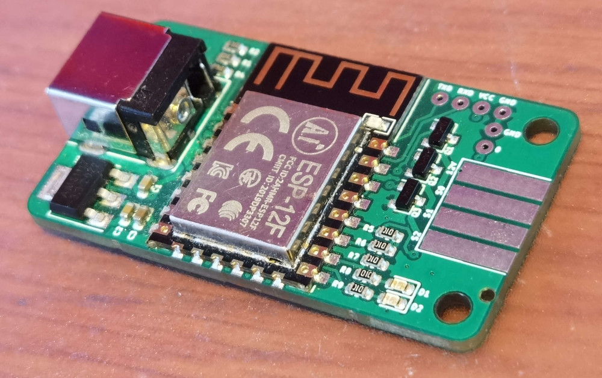
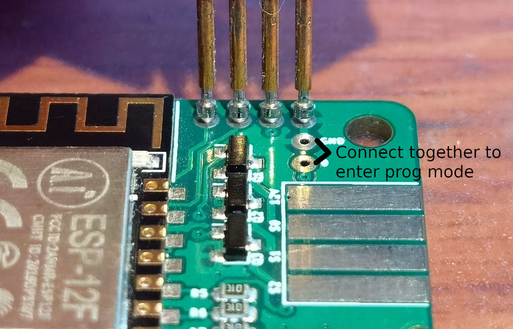

ESP8266 RGB Strip Controller
================

This is a simple ESP8266 based RGB Strip Controller for common color LED strips. It is designed for LED strips which have a common +12V and a negative Pin for each color. But it can also be used to switch single color LED strips or other appliances which don't exceed the current of 6A per Channel.

The Controller can be powered by a 12V DC Jack. Center positive.

### Programming

Programming is possible with `esptool` and a standard 3.3V UART Port. Connect TX and RX crossed with your UART Port, bridge the GPIO0 pad to GND and connect Power to it. Afterwards you can loose the GPIO0 to GND connection and let `esptool` upload the Firmware.

### Enclosure

In the folder `enclosure` are 3D files for a 3D printable enclosure.

### Assembly

Except the DC Jack all parts are available in the Assembly Service of JLCPCB. The DC Jack can be ordered together with the JLCPCB Order on LCSC.